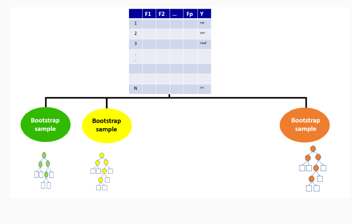
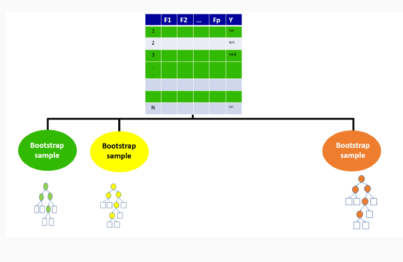
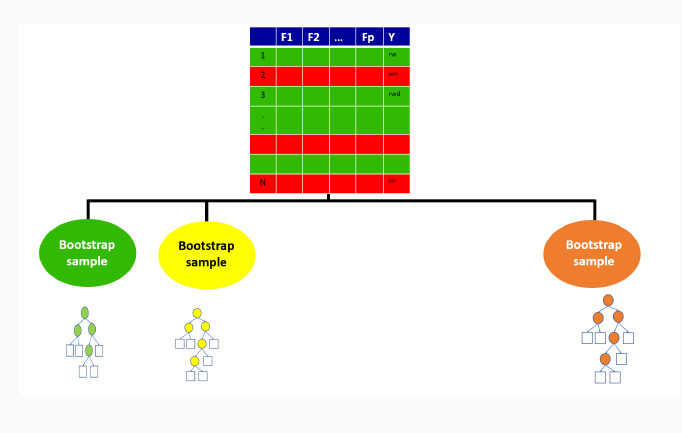
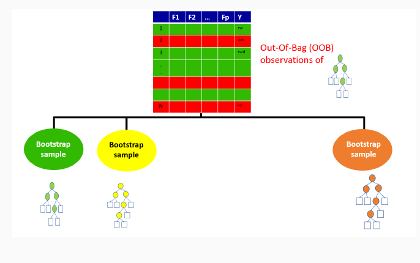
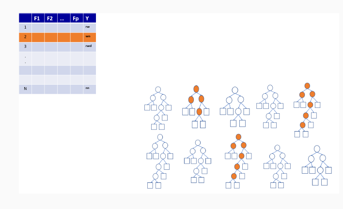
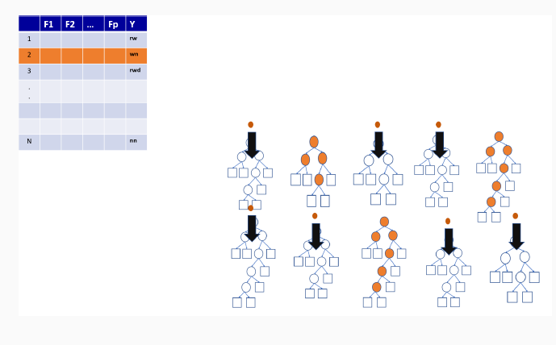
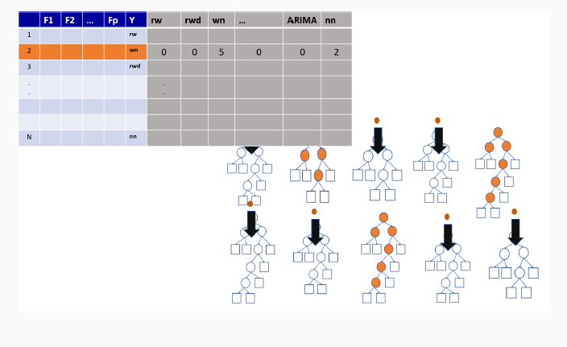
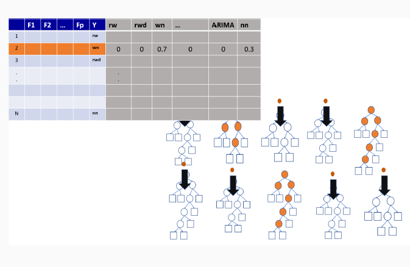
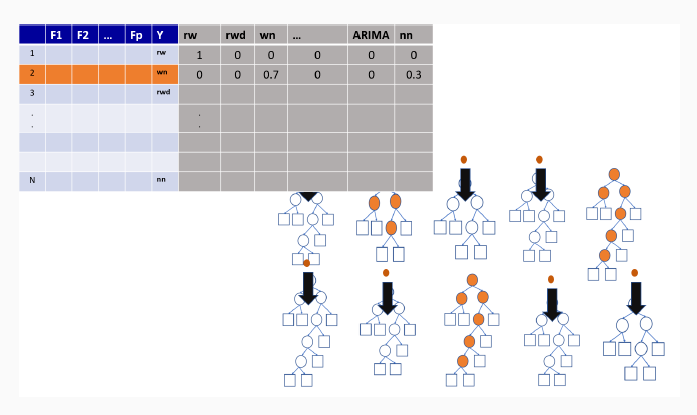

## Classification and Regression Trees

[Slides](https://thiyangt.github.io/Data.Mining/week2/#/title-slide)

### Construct a decision tree using R

### Packages

```{r, warning=FALSE, message=FALSE}
library(tidymodels)
library(palmerpenguins)
library(rpart)
library(skimr)
library(rpart.plot)
library(GGally)
```

### Data

```{r, warning=FALSE, message=FALSE}
data(penguins)
skim(penguins)
```

### Exploratory Data Analysis

1. Your turn: Perform an exploratory data analysis

2. What are the limitations of the following chart? Could you suggest ways to reduce clutter and enhance its clarity?

```{r, warning=FALSE, message=FALSE}
ggpairs(penguins, aes(colour = species), progress = FALSE) +
    theme_bw()
```

### Remove missing values

```{r, warning=FALSE, message=FALSE}
penguins <- drop_na(penguins)
```

### Split data

```{r, warning=FALSE, message=FALSE}
library(rsample)
set.seed(123)
penguin_split <- initial_split(penguins, strata = species)
penguin_train <- training(penguin_split)
penguin_test <- testing(penguin_split)
```

###  Display the dimensions of the training dataset

```{r, warning=FALSE, message=FALSE}
dim(penguin_test)
dim(penguin_train)
```

### Build Decision Tree

```{r, warning=FALSE, message=FALSE}
tree1 <- rpart(species ~ ., penguin_train,  cp = 0.1)
rpart.plot(tree1, box.palette="RdBu", shadow.col="gray", nn=TRUE)
```

### Make predictions

```{r, warning=FALSE, message=FALSE}
head(predict(tree1, penguin_test))
head(predict(tree1, penguin_test,  type = "class"))
```

### Evaluate accuracy over the test set

```{r}
library(caret)
penguin_test$predict <- predict(tree1, penguin_test,  type = "class")
confusionMatrix(data = penguin_test$predict,
                reference = penguin_test$species)
```

## Random forests

- Bagging ensemble method

- Gives final prediction by aggregating the predictions of bootstrapped decision tree samples.

- Trees in a random forest are independent of each other.

- With ensemble methods, we get a new metric for assessing the
predictive performance of the model, the out-of-bag error

## Illustration of how random forests algorithm works

### Boostrap Sample for the first tree






### Out-of-bag sample for the first tree






### Out-of-bag sample predictions












### Variable importance measures in random forest

- Permutation-based variable importance

- Mean decrease in Gini coefficient

### Random forest using R

```{r, warning=FALSE, message=FALSE}
set.seed(123)
library(randomForest)
rf <- randomForest(species ~ ., penguin_train)
```

### Make predictions and evaluate accuracy over the test set

```{r, warning=FALSE, message=FALSE}
penguin_test$predictrf <- predict(rf, penguin_test,  type = "class")
confusionMatrix(data = penguin_test$predictrf,
                reference = penguin_test$species)
```

### Receiver Operating Characteristic (ROC) curves

- Graphical plot that illustrates the performance of a binary classifier model.

### When to Use an ROC Curve?

- Binary Classification: It is particularly useful when you have two classes (e.g., yes/no, positive/negative).

- Imbalanced Datasets: It’s beneficial for imbalanced classes since it doesn't rely on accuracy, which can be biased when one class is significantly more frequent than the other.

- Comparing Models: It’s a great tool for comparing multiple classifiers on the same dataset to see which performs better across thresholds.